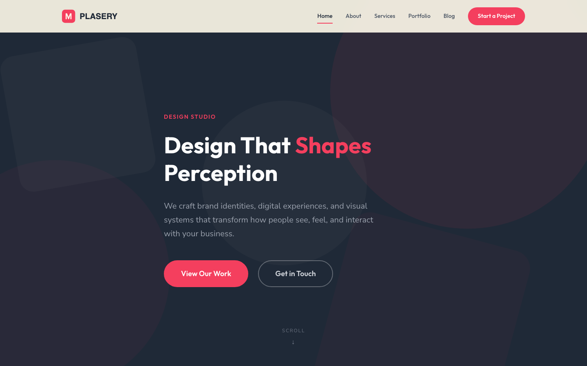

# PLASERY - Design Studio HTML Template

> "Design That Shapes Perception"

A premium, framework-free HTML template for a design studio. Built with semantic HTML5, CSS custom properties, and vanilla JavaScript. No dependencies, no build tools required.

## 📸 Screenshot



## Live Pages

| Page | Description |
|------|-------------|
| [index.html](index.html) | Homepage -- hero, featured work, services, testimonials, CTA |
| [about.html](about.html) | Our story, values, team members, and studio stats |
| [services.html](services.html) | Service details, process overview, pricing CTA |
| [portfolio.html](portfolio.html) | Filterable project grid with category tabs |
| [blog.html](blog.html) | Article cards with categories, dates, and read times |
| [contact.html](contact.html) | Contact form with validation, info cards, and office details |

## Brand Identity

- **Studio Name:** PLASERY
- **Tagline:** Design That Shapes Perception
- **Primary Color (Coral):** `#F43F5E`
- **Dark Color (Charcoal):** `#1F2937`
- **Light Color (Cream):** `#FFFBEB`
- **Heading Font:** Outfit
- **Body Font:** Nunito Sans

## Features

- **CSS Custom Properties** -- Full design token system for colors, spacing, typography, shadows, and transitions
- **IntersectionObserver Animations** -- Scroll-triggered reveal effects with stagger support, disabled for `prefers-reduced-motion`
- **Mobile Navigation** -- Hamburger toggle with full-screen overlay, smooth transitions
- **Portfolio Filters** -- Category-based filtering with data attributes
- **Form Validation** -- `data-form` attribute-driven validation with `.form-ok` and `.form-err` states
- **Counter Animation** -- `[data-year]` attribute triggers animated number counting on scroll
- **Responsive Design** -- Fluid layouts from 480px to 1440px+
- **Accessible** -- Semantic HTML, ARIA labels, keyboard navigation, reduced motion support
- **Zero Dependencies** -- No frameworks, no libraries, no build step

## Technical Details

### Files

```
design-studio-html-template/
  index.html
  about.html
  services.html
  portfolio.html
  blog.html
  contact.html
  style.css
  main.js
  README.md
  assets/
    img/
      (32 SVG placeholder images)
```

### CSS Architecture

All styles use CSS custom properties defined in `:root`. Key variable groups:

- **Colors:** `--coral`, `--charcoal`, `--cream`, `--gray-*`
- **Typography:** `--font-heading`, `--font-body`, `--fs-*`
- **Spacing:** `--space-*` (xs through 5xl)
- **Layout:** `--container-max`, `--header-height`
- **Effects:** `--shadow-*`, `--radius-*`, `--transition-*`

### JavaScript Features

- **IntersectionObserver** for `.reveal`, `.reveal-left`, `.reveal-right`, `.reveal-scale`, and `.stagger-children` elements
- **`[data-year]`** counter animation with eased counting
- **`[data-form]`** validation with `.form-ok` / `.form-err` feedback states
- **Mobile nav** toggle with body scroll lock
- **Smooth scroll** for anchor links
- **Header scroll** effect (background blur + shadow)

### Performance

- Only external resources: Google Fonts (Outfit + Nunito Sans)
- All images are inline SVG placeholders (no network requests)
- IntersectionObserver used instead of scroll event listeners
- `prefers-reduced-motion` fully respected

## Getting Started

1. Open `index.html` in any modern browser
2. No server required -- works as static files
3. Replace SVG placeholders with your own images
4. Customize colors by editing CSS custom properties in `:root`

## Start Your Project

Ready to shape your brand with PLASERY?

**[Start a Project with PLASERY](https://tally.so/r/q4q1L9)**

## License

Free to use for personal and commercial projects.
